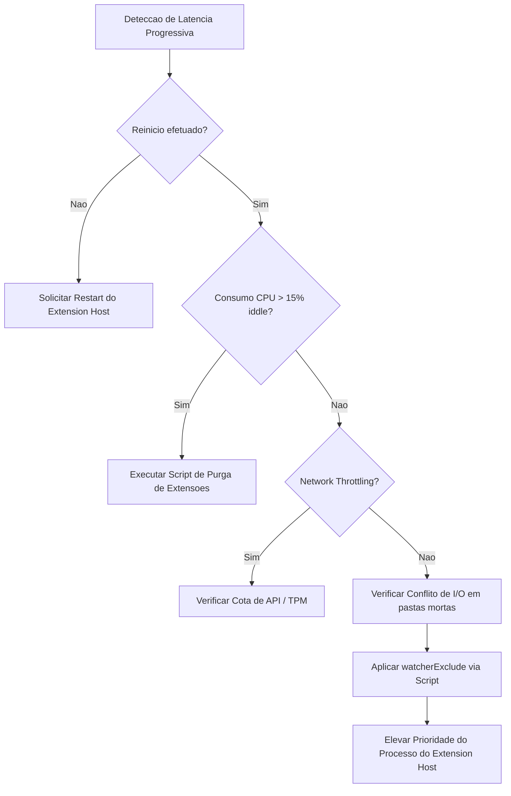
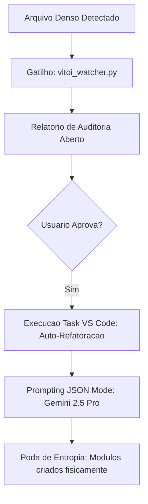

# PROTOCOLO SOTA: RESOLUCAO DE LATENCIA PROGRESSIVA

> **Status:** Ativo | **Implementacao:** Raphael Vitoi & CHICO System
> **Objetivo:** Obliterar gargalos de I/O, CPU e Rede na IDE e no Ecossistema Hibrido.

## 1. O Grafo de Decisao (Fluxo Deterministico)

Abaixo esta a arvore de diagnostico exata que o sistema (ou o arquiteto) deve percorrer ao detectar uma arritmia na velocidade de resposta ou execucao:

## 2. Integracao Sistematica (A Cura Embutida)

Este grafo transcende a teoria. Ele esta fisicamente ancorado nas rotinas de infraestrutura do nosso repositorio. Quando o fluxo atinge as camadas de execucao, as seguintes ferramentas cirurgicas sao acionadas:

*   **No [E] - Purga de Extensoes:** Aciona a aniquilacao de IAs redundantes e ruidos no Extension Host.
    *   `python .\scripts\routines\vitoi_extension_purge.py`
*   **No [I] - Aplicar watcherExclude:** Aplica a "cegueira seletiva" na IDE, bloqueando o Git e a telemetria de varrerem diretorios de alta densidade (node_modules, .venv, .backups_sota).
    *   `python .\scripts\routines\vitoi_optimize_vscode.py`

## 3. O Motor de Autopoiese (Auto-Refactor VITOI 3.2)

Quando a entropia de um arquivo se aproxima da cota (Throttling Adaptativo), o sistema intercepta a execucao atraves do relatorio de auditoria e pode acionar a refatoracao generativa ($S_{final} = \sum_{i=1}^{n} S_{module\_i} + \Delta I_{interf}$).

---
*A arquitetura SOTA nao confia na memoria humana para resolver crises; ela codifica a solucao nas paredes do proprio labirinto.*